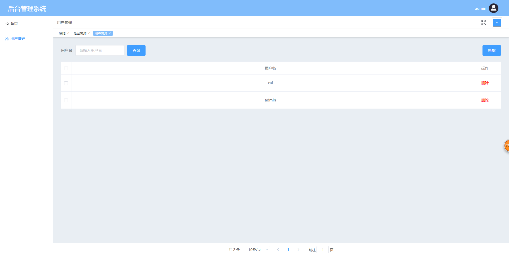
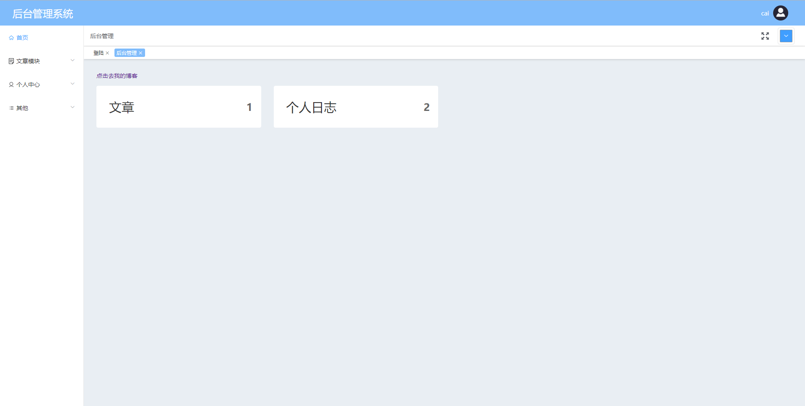
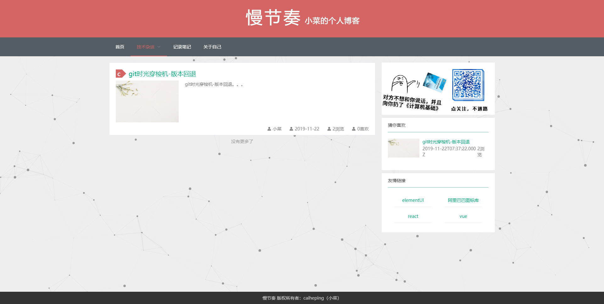
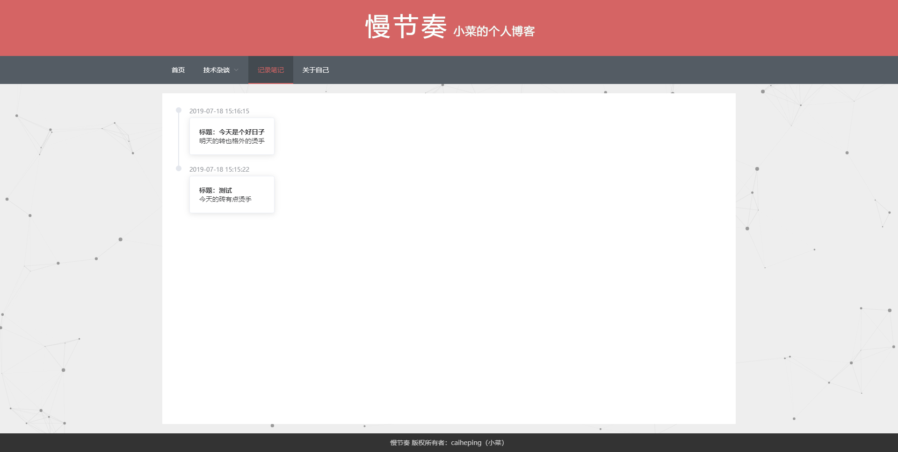
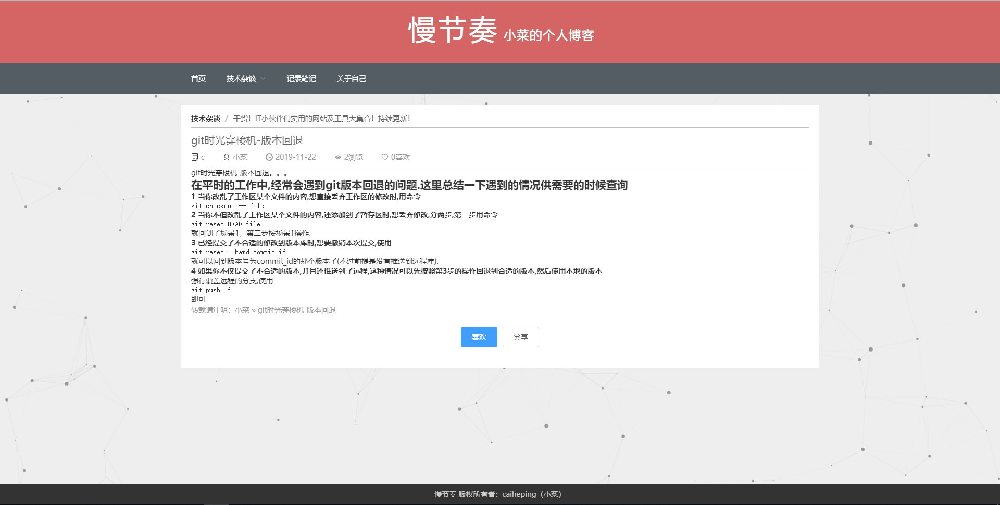

# 前言
这个项目是我闲着无聊弄出来的

### 技术栈

前端技术栈：vue2 + vuex + vue-router + webpack + ES6/7 + less + flex + svg + axios + elementUI等

后端技术栈：node + koa2 + sequelize + mysql


## 项目运行
#### 首先下载(克隆)后端代码，安装依赖并开启服务器（详细说明请前去：https://github.com/caiheping/node-blog-server）

#### 前端项目运行
```
git clone https://github.com/caiheping/node-blog-client.git
cd ./node-blog-client
npm install
npm run serve
```
admin登录账号：admin，密码： 123456，admin用户只能管理用户，没有前端博客界面。
普通用户账号密码自己用admin去用户管理创建

## 说明

>  如果对您有帮助，您可以点右上角 "Star" 支持一下 谢谢！ ^_^

## 目标功能
后台管理
- [x] 登录 -- 完成
- [x] 用户管理 -- 完成
- [x] 发表文章 -- 完成
- [x] 发表日志 -- 完成
- [x] 轮播管理 -- 完成
- [x] 友情链接 -- 完成

前端展示
- [x] home首页展示 -- 完成
- [x] 查看文章 -- 完成
- [x] 查看日志 -- 完成
- [x] 查看个人信息 -- 完成
- [x] 添加喜欢文章 -- 完成

# 前端后台管理界面
## admin用户（默认账号：admin, 密码：123456）




## 普通用户



# 前端后台管理界面







